# SmartWasteMovil – Documentación Completa

Versión móvil del sistema SmartWaste para la gestión de residuos urbanos.

---

## 📌 Descripción General del Prototipo

SmartWasteMovil es una aplicación móvil diseñada para optimizar la gestión de residuos urbanos mediante el uso de sensores IoT, análisis de datos en tiempo real y herramientas digitales accesibles para personal operativo y autoridades municipales. La plataforma integra una aplicación móvil, un dashboard web y una API avanzada que permite gestionar contenedores, rutas de recolección, notificaciones y monitoreo en vivo del estado de los residuos.

Este prototipo móvil permite al personal de recolección visualizar rutas optimizadas, recibir alertas de contenedores llenos y reportar incidencias directamente desde el campo. Con ello, se busca reducir costos operativos, mejorar los tiempos de recolección y contribuir a la sostenibilidad de la ciudad.

SmartWasteMovil forma parte del ecosistema SmartWaste, una solución integral enfocada en mejorar la eficiencia, transparencia y sostenibilidad de los servicios de recolección urbana.

---

## 🎯 Objetivo General

Diseñar e implementar un prototipo móvil que facilite la operación del sistema SmartWaste, permitiendo al personal acceder a información en tiempo real, gestionar rutas y monitorear contenedores mediante conectividad con sensores IoT.

---

## ✅ Objetivos Específicos

1. Integrar sensores IoT que registren el estado y nivel de llenado de contenedores.
2. Implementar una app móvil para visualizar rutas óptimas y alertas.
3. Desarrollar un panel interactivo para autoridades con métricas en tiempo real.
4. Automatizar procesos de monitoreo y rutas de recolección.
5. Realizar pruebas de funcionamiento en escenarios simulados para validar el prototipo.

---

## 🏢 Identidad Gráfica

### Logos

| Logo del Producto | Logo de la Empresa |
|-----------------------|---------------------|
|  |  |

### Paleta de Colores

* Verde #2ECC71 – Sustentabilidad
* Azul #3498DB – Tecnología
* Gris oscuro #2C3E50 – Profesionalismo
* Blanco #ECF0F1 – Limpieza

### Tipografías

* **Montserrat** – Títulos y encabezados
* **Roboto** – Texto del cuerpo

---

### 📝 Planteamiento del problema.
La gestión de residuos sólidos urbanos es un desafío creciente para comunidades de todos los tamaños. En México, se generan más de **120 mil toneladas de basura diariamente**, de las cuales una parte significativa no se recolecta de manera eficiente.  

Los principales problemas detectados son:  
- **Contenedores saturados** antes de la fecha programada de recolección, ocasionando acumulaciones en la vía pública, malos olores y riesgos sanitarios.  
- **Rutas innecesarias hacia contenedores medio vacíos**, generando gastos operativos elevados, consumo excesivo de combustible y emisiones contaminantes.  
- **Falta de monitoreo en tiempo real**, que impide a las autoridades y empresas de recolección tomar decisiones basadas en datos precisos.  

Actualmente, la mayoría de los sistemas de recolección operan bajo esquemas fijos, sin tomar en cuenta el nivel real de llenado de los contenedores, lo que provoca ineficiencias económicas, logísticas y ambientales.  

### 💡 Propuesta de solución.
**SmartWaste** es una solución tecnológica integral basada en **IoT y análisis de datos en tiempo real** que busca optimizar la gestión de residuos urbanos.  

La propuesta consiste en:  
1. **Dispositivos IoT en contenedores de basura**  
   - Sensores ultrasónicos o infrarrojos para medir el nivel de llenado.  
   - Transmisión de datos en tiempo real hacia una plataforma central.  

2. **Aplicación Movil**  
   - Visualización del estado de cada contenedor en una interfaz interactiva.  
   - Alertas automáticas cuando un contenedor alcanza un umbral crítico de llenado.  
   - Reportes históricos para analizar patrones de generación de residuos.  

3. **Optimización de rutas de recolección**  
   - Algoritmos que sugieran recorridos más eficientes.  
   - Reducción de costos operativos y emisiones contaminantes.  

4. **Impacto esperado**  
   - Reducción de acumulación de basura en vía pública.  
   - Ahorro de recursos en combustible y personal.  
   - Contribución a los **ODS 11 (Ciudades sostenibles)** y **ODS 12 (Consumo responsable)**.  

---

### 👥 Organigrama de Trabajo.

---

### 👥 Tabla de Colaboradores.

| Nombre                        | Rol                          | Usuario               |  
|-------------------------------|------------------------------|-----------------------|  
| Jose Luis Campos Marquez      | Desarrollador Backend y CEO       | [@JoseLuisCM663](https://github.com/JoseLuisCM663)         |  
| Juan Alberto Vazquez Hernandez | Desarrollador Frontend       | [@juuaaann456](https://github.com/juuaaann456)           |  
| Omar Lemuel Espejel Lira       | Desarrollador Database       | [@lemuel-26](https://github.com/lemuel-26)             |  
| Zamira Cuevas Zamora   | Documentador           | [ZamyCuevas](https://github.com/ZamyCuevas)         |  
---

## 👨‍💻 Contribuciones Detalladas

### Jose Luis Campos Marquez – Backend y CEO

* Arquitectura completa de la API con FastAPI
* JWT, roles, permisos y seguridad
* Métricas del sistema y observabilidad
* CRUD de incidencias y monitoreo
* Documentación Swagger y ReDoc

### Juan Alberto Vazquez Hernández – Frontend

* Diseño completo en Figma
* Mockups de alta fidelidad
* Prototipo navegable
* Desarrollo en React/Next.js
* Integración con la API

### Omar Lemuel Espejel Lira – Base de Datos

* Diseño y normalización de MySQL
* Optimización de consultas
* Integridad referencial con FK
* Configuración en Railway

### Zamira Cuevas Zamora – Documentación

* Redacción técnica
* Diseño visual de documentos
* Estructura del manual técnico

---

## 📅 Diagrama de Gantt

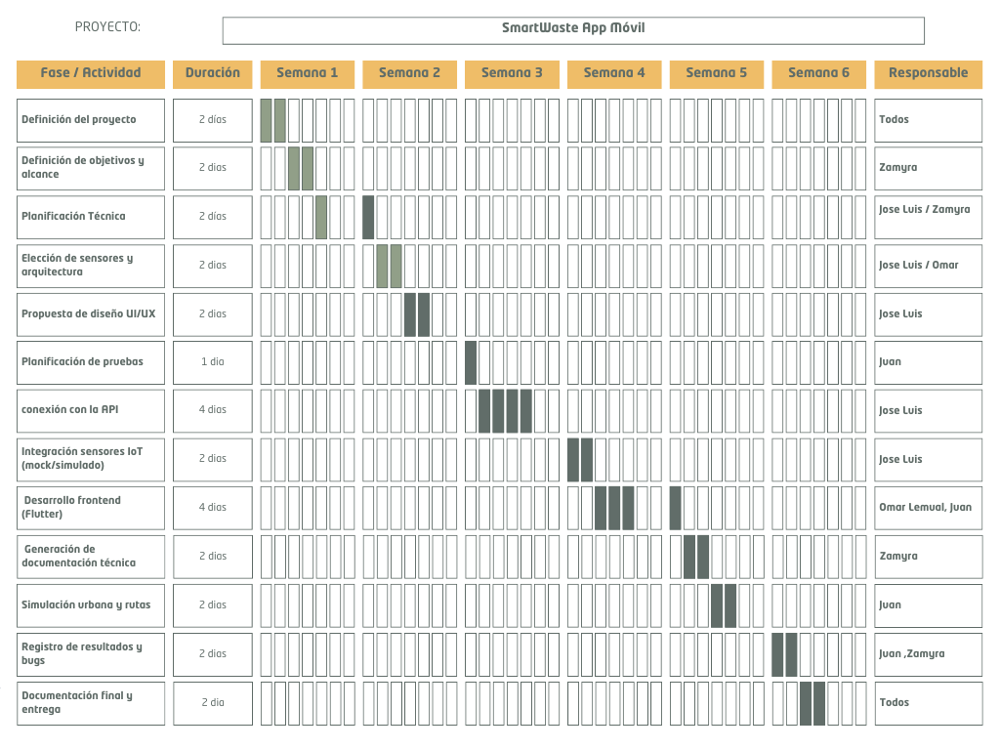

---

## 📘 Requerimientos Funcionales

1. RF01: Registrar usuarios con rol asignado.
2. RF02: Iniciar sesión mediante JWT.
3. RF03: Consultar lista de contenedores.
4. RF04: Crear, modificar y eliminar contenedores.
5. RF05: Consultar sensores y lecturas.
6. RF06: Generar rutas de recolección.
7. RF07: Mostrar rutas optimizadas al usuario.
8. RF08: Recibir alertas por contenedores llenos.
9. RF09: Registrar incidencias desde la app.
10. RF10: Visualizar estadísticas en tiempo real.

---

## 📗 Requerimientos No Funcionales

1. RNF01: La app debe responder en menos de 500 ms.
2. RNF02: La autenticación debe cumplir con estándares JWT.
3. RNF03: Debe ser compatible con Android 8+.
4. RNF04: El backend debe soportar 200 solicitudes simultáneas.
5. RNF05: El almacenamiento de datos debe ser seguro y cifrado.

---

## 🧠 Historias de Usuario

1. HU01: Como recolector, quiero ver la ruta asignada para optimizar mi trabajo.
2. HU02: Como supervisor, quiero ver el estado de los contenedores en tiempo real.
3. HU03: Como recolector, deseo recibir alertas cuando un contenedor esté lleno.
4. HU04: Como administrador, quiero agregar nuevos contenedores desde el panel.
5. HU05: Como recolector, quiero reportar incidencias.
6. HU06: Como supervisor, quiero generar reportes históricos.
7. HU07: Como administrador, deseo gestionar usuarios.
8. HU08: Como recolector, deseo acceder rápidamente a los niveles de llenado.
9. HU09: Como administrador, quiero actualizar información del contenedor.
10. HU10: Como usuario móvil, quiero tener una interfaz clara y accesible.

---
### Lista de Tecnologias
| Tecnología      | Descripción                                                                      |
|-----------------|----------------------------------------------------------------------------------|
|    | Lenguaje de programación desarrollado por Microsoft que se basa en JavaScript |
|           | Base de datos relacional para la gestión de datos |
|                   | Estilos y diseño responsivo |
|  | Lenguaje de programación para la lógica en el frontend y backend |
|  | Archivo de documentación para el proyecto |

## ✏ Sketches
Los sketches son dibujos rápidos hechos a mano que permiten visualizar las primeras ideas del diseño. Se utilizan para definir la estructura general de las pantallas, la distribución de elementos y el flujo básico, antes de crear wireframes o mockups más detallados.

* Splash Screen
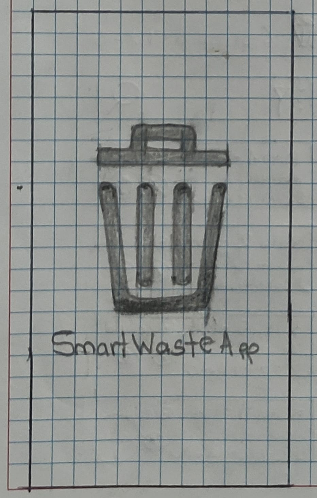

* Registro de Usuario.

* Predición de Eficiencia
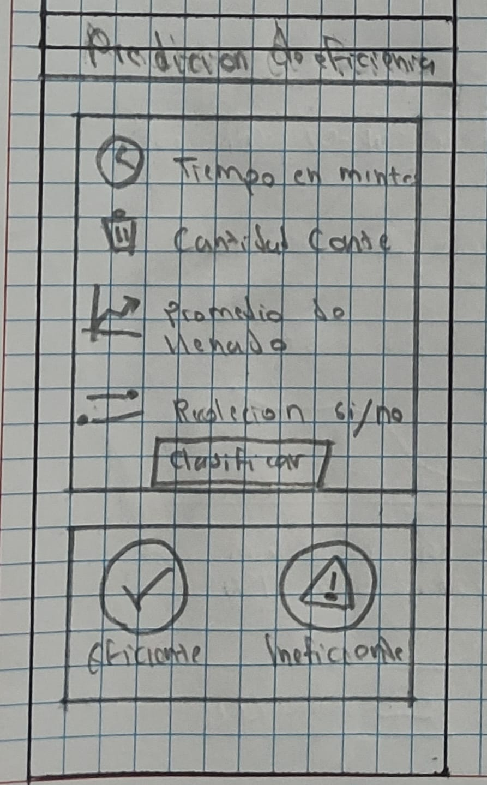

* Mapa
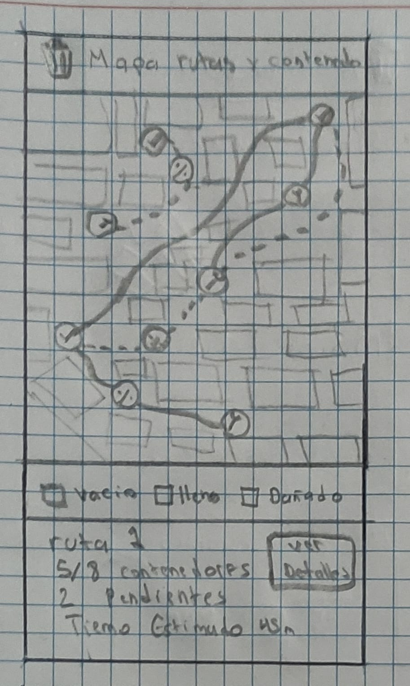

* Login Screen
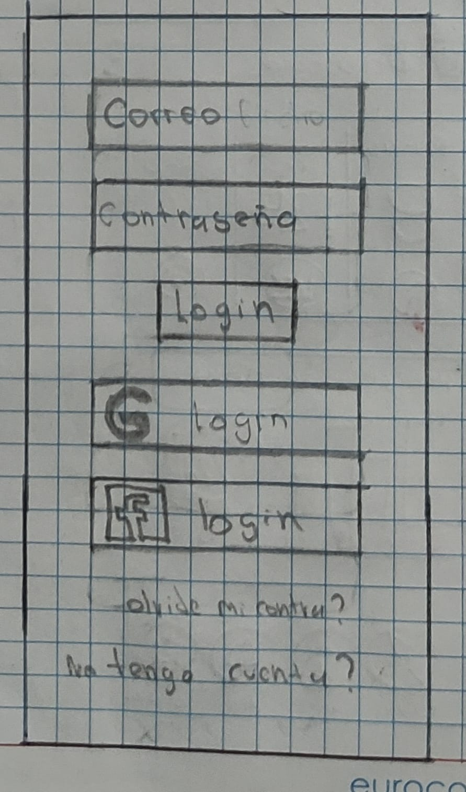

* LoadingScreen

* Historial de Lecturas

* Gestion de Sensores

* Gestión de Rutas

* Gestión de Contenedores

* Detalle de ruta
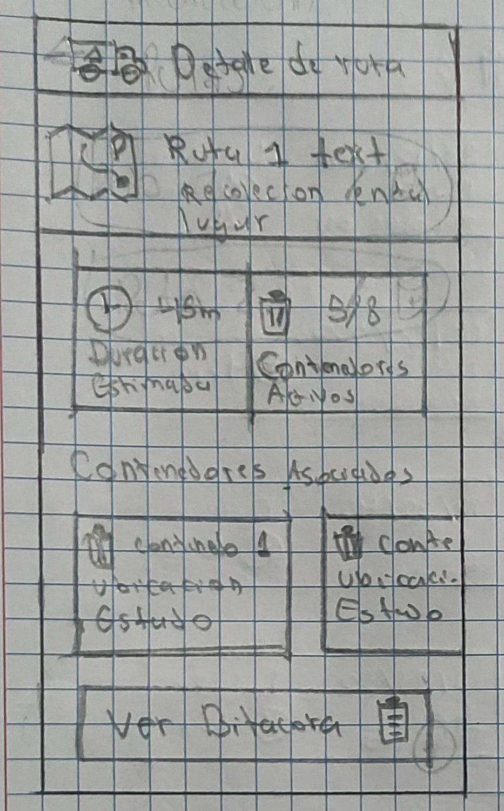

* Detalle de Contenedor
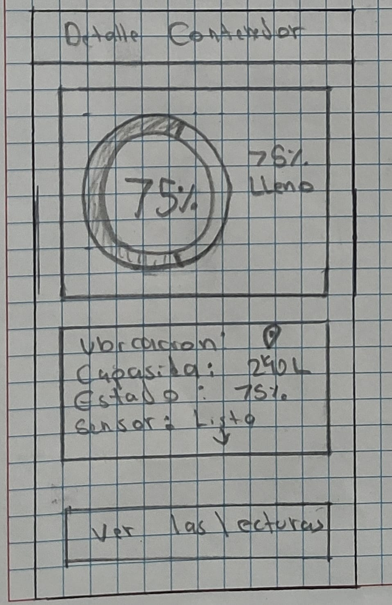

* Dashboard Principal
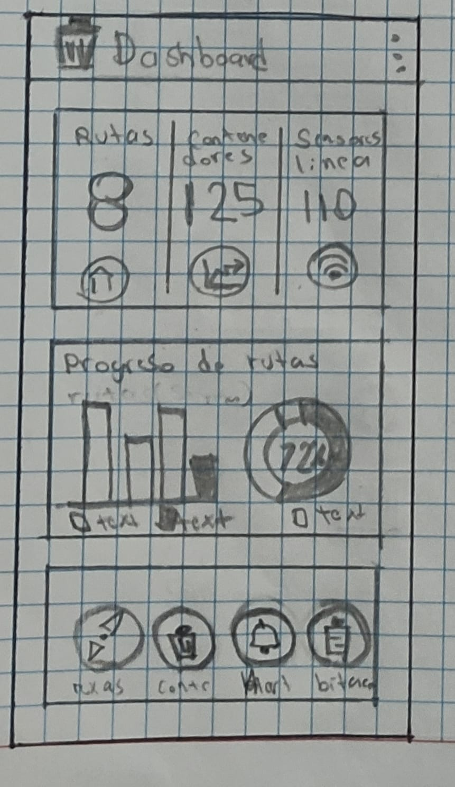

* Bitacora de Recoleción

* About Us (Acerca de SmartWaste)

---

## 📐 Wireframes

Los wireframes son representaciones de baja o media fidelidad que muestran la estructura funcional de cada pantalla. Se enfocan en la colocación de elementos, navegación y jerarquía visual, sin incluir colores finales ni diseño estético. Sirven como base para validar el funcionamiento y flujo del usuario.

* Splash Screen
  
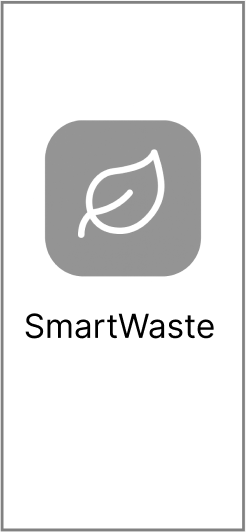

* Registro de Usuario.
  
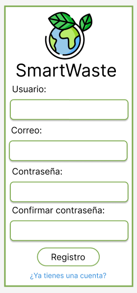

* Predición de Eficiencia
  
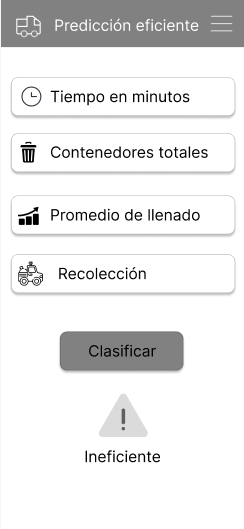

* Mapa
  
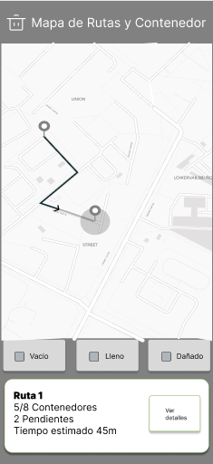

* Login Screen
  
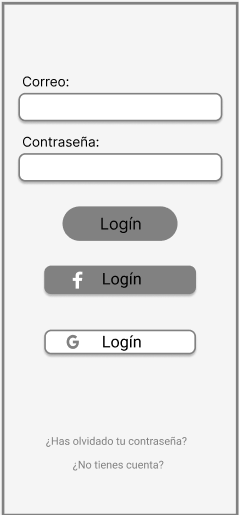

* LoadingScreen
  
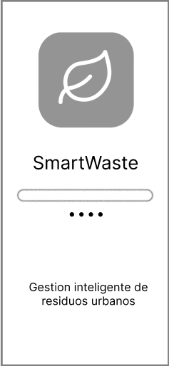

* Historial de Lecturas
  
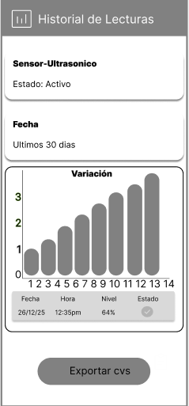

* Gestion de Sensores
  
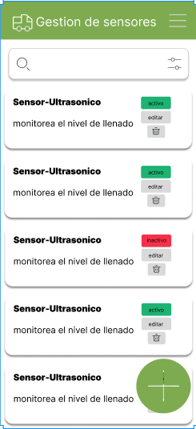

* Gestión de Rutas
  
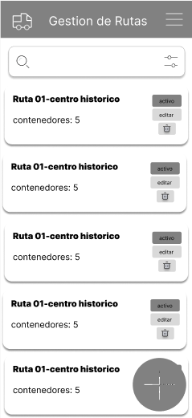

* Gestión de Contenedores
  
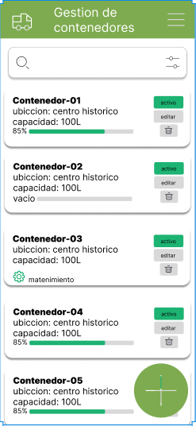

* Detalle de ruta
  

* Detalle de Contenedor
  
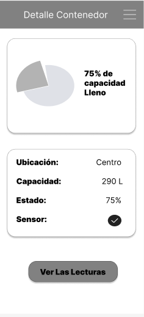

* Dashboard Principal
  
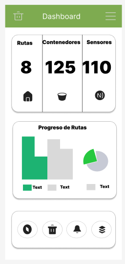

* Bitacora de Recoleción
  

* About Us (Acerca de SmartWaste)
  
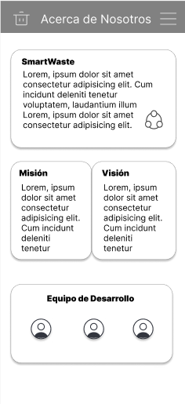

---

## 🎨 Mockups

Los mockups son diseños de alta fidelidad que muestran la apariencia visual final de la aplicación. Incluyen colores, tipografías, íconos, estilos y componentes reales. Permiten visualizar cómo se verá la app antes de programarla.

---

## 📱 Prototipo Navegacional
El prototipo navegacional es una versión interactiva del diseño que permite simular la experiencia real del usuario. Muestra la navegación entre pantallas, transiciones, botones funcionales y el flujo completo de uso de la aplicación, tal como si fuera una app real. 

Link de Figma: 

---

## 🔗 API

Repositorio Backend: [https://github.com/JoseLuisCM663/Smartwaste_Api](https://github.com/JoseLuisCM663/Smartwaste_Api)

---

## 📲 Prototipo Programado (Avances)

---

## 📝 Presentación Final

---

## 🧩 Conclusiones

El desarrollo de SmartWasteMovil permitió comprender el valor del IoT, la importancia de la optimización en servicios urbanos y la relevancia de integrar herramientas multidisciplinarias para resolver problemas reales. Este prototipo demuestra el potencial de las tecnologías móviles aplicadas a la gestión ambiental y sienta las bases para una futura implementación a gran escala.
